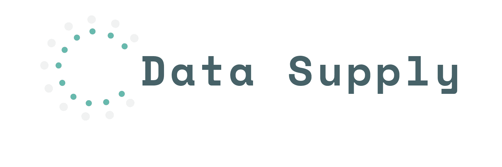

# DATA-SUPPLY  



DATA-SUPPLY是DATA-TALK的后端
+ 使用sqlite3，对数据进行存储
+ 使用Koa作为后端框架

## Installation
```
git clone https://github.com/HLGhpz/Data-Support
pnpm install
pnpm start
```
## Changelog
Detailed changes for each release are documented in the [release notes](https://github.com/HLGhpz/Data-Support/blob/main/CHANGELOG.md).
## License
Data-Supply is MIT licensed.